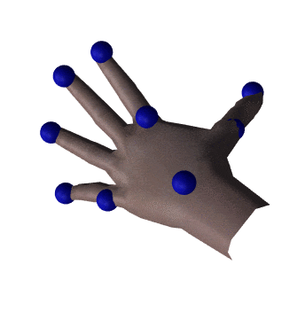
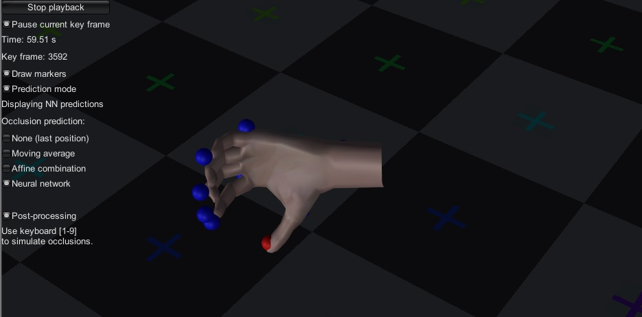

# Robust Real-Time Finger Tracking


This repository contains the demo for the approach described in our paper:
> Dario Pavllo, Thibault Porssut, Bruno Herbelin, and Ronan Boulic. *Real-Time Finger Tracking using Active Motion Capture: a Neural Network Approach Robust to Occlusions*. To appear in *MIG '18: Motion, Interaction and Games*, November 8--10, 2018, Limassol, Cyprus.

This work has been done at the Immersive Interaction Group (IIG) at EPFL.

We release our dataset, the Python code to train the model, pretrained models, and a demo for Unity Engine that can be tested out of the box.

### Abstract
Hands deserve particular attention in virtual reality (VR) applications because they represent our primary means for interacting with the environment. Although marker-based motion capture with inverse kinematics works adequately for full body tracking, it is less reliable for small body parts such as hands and fingers which are often occluded when captured optically, thus leading VR professionals to rely on additional systems (e.g. inertial trackers). We present a machine learning pipeline to track hands and fingers using solely a motion capture system based on cameras and active markers. Our finger animation is performed by a predictive model based on neural networks trained on a movements dataset acquired from several subjects with a complementary capture system. We employ a two-stage pipeline, which first resolves occlusions, and then recovers all joint transformations. We show that our method compares favorably to inverse kinematics by inferring automatically the constraints from the data, provides a natural reconstruction of postures, and handles occlusions better than three proposed baselines.

## Dependencies
To train the model:
- Python 3+
- Keras >= 2
- NumPy and SciPy

Demo:
- Unity >= 5.5.0f3
- Accord .NET (only Math namespace, already included in the project)

## Dataset
You can download the dataset (in CSV) from the *Release* section of this repository. It consists of the motion capture data of 4 subjects, as well as the corresponding joint transformations.

The dataset must be copied to `Training/data` in order to train the model.

## Training the model
After copying the dataset, in the `Training` directory there are two scripts for training the model:

- `train_marker_model.py` trains the occlusion prediction model and saves the weights to `marker_model.bin`.
- `train_joint_model.py` trains the joint prediction model and saves the weights to `joint_model.bin`.

The two `.bin` files must be copied to `Demo/models`, which already contains our pretrained models.

## Demo
The `Demo` directory contains a Unity project that can be used to visualize the dataset and test our models. Press `Play recording` to load a recorded animation (it does not matter whether you load the `fused` or the `mocap` file, the other will be loaded automatically). Then, you can visualize the neural network predictions and switch between different occlusion managers.



## License
We release our code under the MIT license. Note that Accord .NET is licensed under LGPL and Unity is subject to its own license.
Should you use our work in your research, please cite our paper:
```
@inproceedings{pavllo:tracking:2018,
  title={Real-Time Finger Tracking using Active Motion Capture: a Neural Network Approach Robust to Occlusions},
  author={Pavllo, Dario and Porssut, Thibault and Herbelin, Bruno and Boulic, Ronan},
  booktitle={ACM SIGGRAPH Conference on Motion, Interaction and Games (MIG)},
  year={2018}
}
```